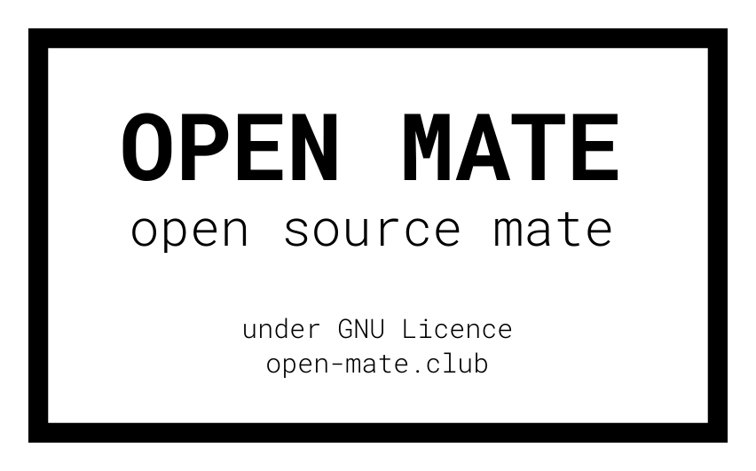
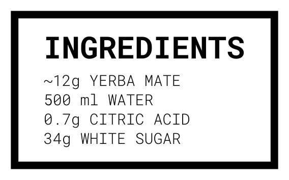

#Open Mate

**Open Source Soda For Hackers**

Open mate is a **Club Mate open source alternative** From the recipe to the packaging and website everything will be found on this repo

Club Mate import is quite expensive in France (3.45 eur for a 50cl bottle) So why not making it yourself ? The average cost for a reconditionned bottle with the Open Mate prep costs 0.30 cent 
The average cost for a reconditionned bottle with a label on it + human cost 0.92 cent

- [Recipe](#recipe)
  - [🫗Make Syrup](#make-syrup)
- [Packaging](#packaging)
  - [Label Print](#label-print)
- [Ressources and Credits](#ressources-and-credits)

# Recipe

## 🫗Make Syrup 

**Ingredients**
* Yerba Mate (35g) - 6 tbsp
* White Sugar 240g
* Water (240ml)

**Syrup prep**

1. In a small saucepan, combine sugar and water.
2. Simmer over medium heat until sugar is dissolved, about 5 to 10 minutes. 
3. Turn off the heat.
4. Add the Yerba Mate
5. Let infuse 5 minutes
6. Filter the liquid
7. Store in a glass bottle

You will get about 300g of syrup (~6-7 bottles of 50cl)

**Bottle fill**
- A Bottle (50cl)
- Mate Syrup 6 tbsp
- Carbonated Water (50cl)
- Citric Acid 0.1 tsp **(teaspoon not table spoon)**

1. Add the syrup in the bottle
2. Add the carbonated water
3. Add the citric acid
4. Seal the bottle

# Packaging

You can use these labels to stick on the bottle

**Front label**

**Back Label**

## Label Print

**Make organic glue**
- Flour (2 tbsp)
- Sugar (0.5 tbsp)
- Water (10-20 cl )

1. Mix everything in a pot
2. Boil the mix
3. Put in a jar

**Put label on bottle**

1. With a brush apply some  glue on the label 
2. Put the label on te bottle

# Ressources and Credits
- https://www.instructables.com/Club-Mate-Copycat/
- https://hungrysofia.com/2014/04/30/yerba-mate-soda/
- https://www.thevert.com/cafeine-et-duree-dinfusion/
- https://revistas.ufpr.br/alimentos/article/view/14928
